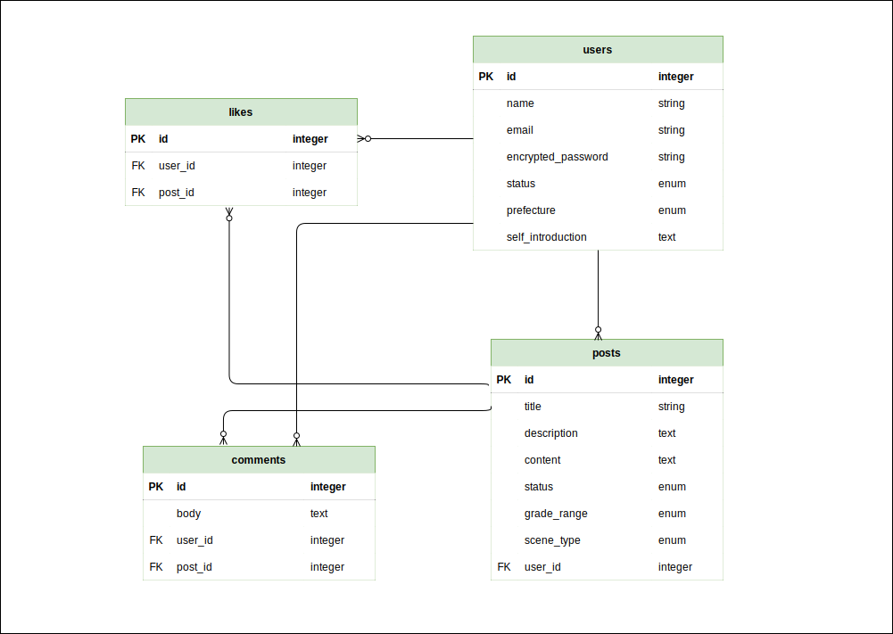

# ■ 校長講話アイディアボックス

## ■ サービスURL

ページ中央（「サービスの使い方」下）にゲストログインボタンを備えていますので、メールアドレスやパスワードの入力の必要なく直ぐにサービスをお試しいただけます。
## ■ 詳しい内容(Qiita)

こちらの記事に開発で苦労したこと等についてまとめています。

## ■ サービス概要
校長講話のアイディアに困っている校長先生と、自分のアイディアを後輩に提供したい元校長先生同士で、講話のアイディアを投稿・共有するサービスです。

## ■ 主な機能とページ
### 1. トップページ
一目で使い方が分かるようにサイトトップにコンセプト及びサービスの使い方の説明を配置しています。

### 2. 講話投稿機能
フォームにはバリデーションを設け入力のしやすさに配慮し、また下書き登録も可能にすることで投稿フローに柔軟さを持たせました。

### 3. ブックマーク機能
ブックマーク機能は素早くシームレスに行われ、ヘッダーの「参考にした講話」から一覧をまとめて見ることができます。

### 4. コメント機能
コメントの投稿・編集・削除の機能群についても全て、講話詳細ページから画面遷移せずにシームレスに行うことができます。

### 5. 検索機能
ヘッダーには検索バーを常時表示させ、いつでも検索機能を使用することができます。また、絞り込み検索にも対応しています。

### その他機能
- ページネーション
- プロフィール編集機能
- 他ユーザーのプロフィール閲覧機能（任意のユーザーの投稿一覧を見ることが可能）

## ■ 開発の経緯とねらい
校長講話のアイディアに悩む校長先生には、従来より書籍という形式でいわゆる「ネタ本」がアイディアの提供という役割を担ってきました。 
しかしGoogleの検索窓で「校長講話」と入力した際のサジェストを見てもわかるように、この時代、インターネットを使用して講話のアイディアを探す校長先生も多くいらっしゃるようです。 
しかしそこでヒットする検索結果は各学校が広報として公にしている講話ばかりで、サービスとして講話を集積しているサイトは見当たりませんでした。 
そこで、全国の校長先生や元校長先生の方々が、自身が持つアイディアを自由に投稿し共有できるサービスがあれば、アイディアを探す校長先生の検索効率を高めるだけでなく、講話を実際に聞く児童・生徒の将来の役に立つ校長講話が少しでも増えるのではないかと考え、このサービスを開発しました。

## ■ 使用技術

### フロントエンド
- Vue.js 2.6.14

### バックエンド
- Ruby 3.1.1
- Rails 6.1.5

### インフラ
- PostgreSQL
- Heroku

## ■ 画面遷移図
[figma](https://www.figma.com/file/LRZq7mKh7wE9n1MdEzcCwf/principal_lecture_ideas?node-id=0%3A1)

## ■ ER図
