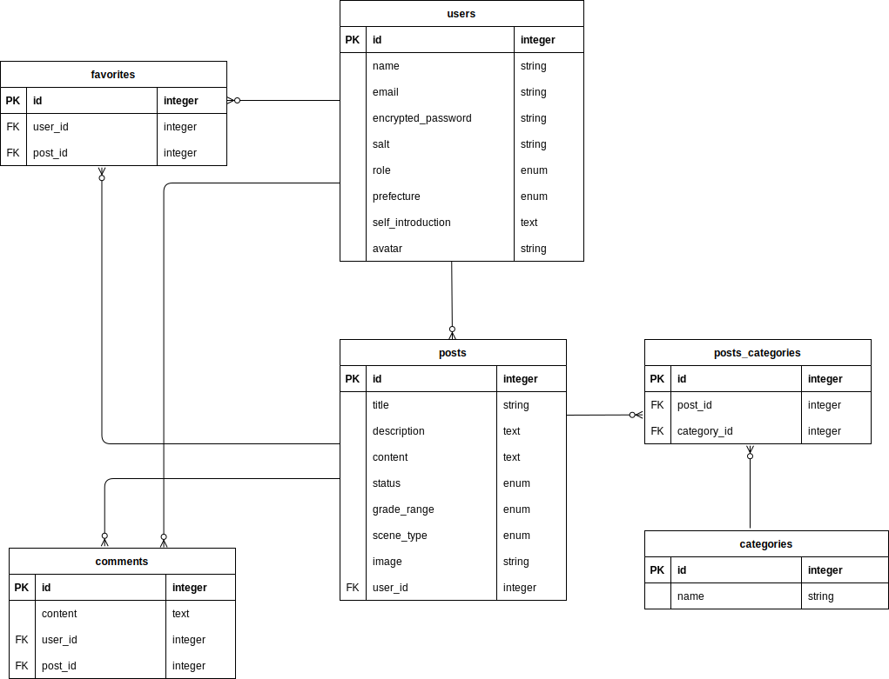

# principal lecture ideas

## サービス概要
校長講話のネタに困っている校長先生と、自分のネタを後輩に提供したい元校長先生同士で、講話のアイディア（事例）を共有するサイトです。

## メインのターゲットユーザー
- 就任したばかりで、講話のネタに困っている校長先生
- 自身の校長時代の講話のアイディアを、後輩校長に提供したい元校長先生

## ユーザーが抱える課題
- 校長先生に就任し、生徒児童の将来のためになるよい校長講話をしたいが、話すネタに困っている。講話の事例集などを購入してみたが、ありきたりのもので参考にならない。
- 自分が校長時代に使った講話のアイディアを後輩校長に提供して子供たちの教育に役立ててほしいが、すでに退職していて伝える手段がない。

## 解決方法
- 現役校長と元校長が自分の講話のアイディアを投稿&共有するプラットフォームを提供する。

## 実装予定の機能
- ゲストユーザー
  - 投稿されたアイディアの閲覧

- 登録ユーザー
  - アイディアの投稿
  - 投稿されたアイディアに対して「参考になった」ボタンを押すことができる。
  - お気に入りのアイディアを保存することができる。
  - 講話の対象（小学校、中学校）、講話にかかる時間、ジャンル（道徳、スポーツ、科学など）による絞り込み機能
  - 「参考になった」数順に投稿を並べ替える機能

- 管理ユーザー
  - 登録ユーザーのCRUD
  - アイディア投稿のCRUD
  - ジャンルのCRUD
  - 管理ユーザーのCRUD

## 順次導入していきたい機能
- アイディア投稿に対するコメント機能

## なぜこのサービスを作りたいのか？
私自身の学生時代を振り返ってみると、「校長先生のお話」（校長講話）というものはほとんど記憶に残っていません。世間一般では、この校長講話に対する評価は芳しくなく、長く退屈で、もっといえばつまらないものと受け止められているようです。
一方で、多くの校長先生は、校長という立場によって得られた、全校生徒の前で一定時間自由にお話ができるという「特権」を活かして、これまでの長い教員生活の経験によって培われた自身の教育観や理念を基に、生徒児童の将来に役立つお話をしたいと願っています。ところが、さまざまなコードや時間的制約、さらに小学校で言えば１年生から６年生まで理解できるお話をしなければならないという「お話の難易度」についての配慮など、考慮すべきことが多岐に渡るため、講話で何を話せばいいのか悩む校長先生が全国でたくさんいらっしゃいます。
そうした中で、多くの校長先生が使用しているのがいわゆる「ネタ本」、つまり「講話集」ですが、これについても、「ありきたりな内容が多い」「一人の元校長先生が書いたものも多く自分の教育観と合わない」などの問題を抱えています。さらにこの問題を難しくしているのが、講話のアイディアやその出来栄えについて、相談する相手がいないという点です。校長先生が学校の他の先生に講話について相談することはその立場的にも難しく、仮に相談や感想を求めたとしても、それを受けた先生が、学校の長に対して自分の意見を正直に伝えることは難しいと考えられます。
こうした背景がありながら、これまでこの校長講話のアイディア問題が、（一般の先生向けの授業や学級経営の支援サイトの充実ぶりとは対照的に）Webサービスの網の目から抜け落ちていたのは、校長先生である期間が短く、講話集を参考に講話の勘所をつかみ校長としての数年間乗り切れば、あとは急速にその需要がなくなってしまうからだと推測されます。とはいえ新たに就任する校長先生も毎年大勢いるわけで、講話のアイディアを渇望する校長先生が全国に常時いらっしゃるということは、毎年のように更新され出版される講話集の存在からも明らかです。
この「principal lecture ideas（仮）」では、全国の校長先生が自らの講話事例やアイディアを共有しまたそれに対するリアクションを可能にするプラットフォームを提供することで、校長先生が自身の講話を考える際の出発点として活用していただくとともに、少なくない元校長先生が持っている、自分の講話事例やその土台となる教育観を後進に伝えたいという需要にも応えます。
これらのことを通じて、聞いた子供たちの将来に役に立つ校長講話が少しでも増えることが、このサービスの目標です。

## 画面遷移図
[figma](https://www.figma.com/file/LRZq7mKh7wE9n1MdEzcCwf/principal_lecture_ideas?node-id=0%3A1)

## ER図
